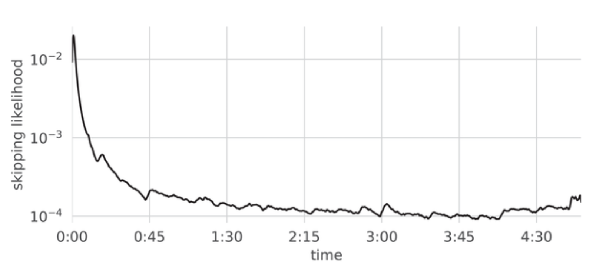
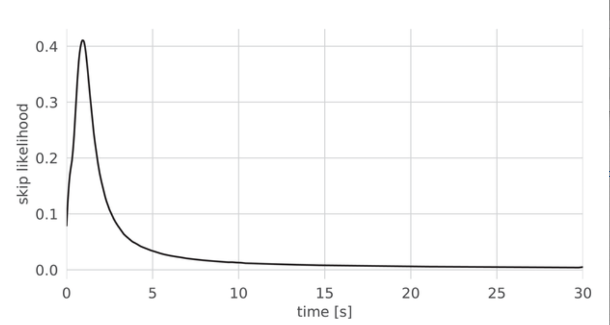
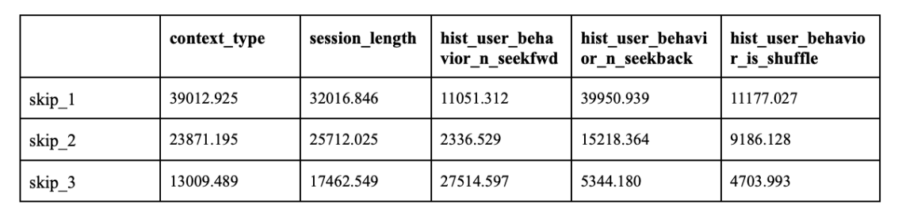
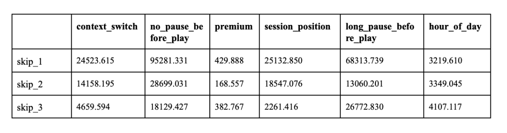
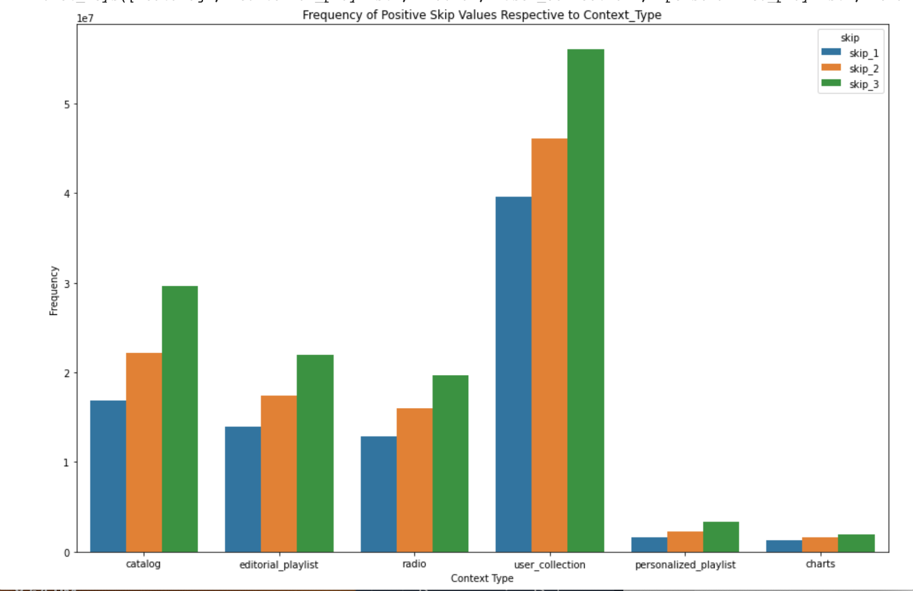
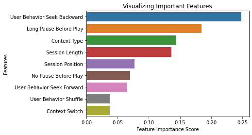
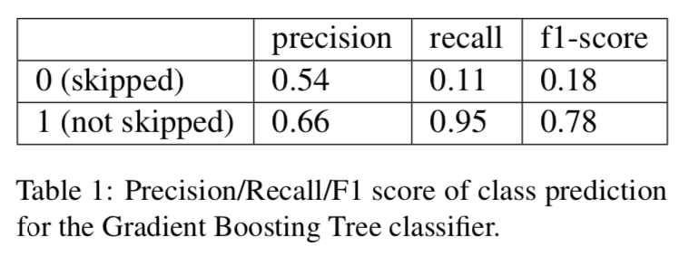

# Spotify-Sequential-Skip-Prediction-Challenge

The 2019 Spotify Sequential Skip Prediction Challenge arose out of a need to understand the quality of Spotify’s personalized song recom- mendation system, and challenges participants to predict if a track in a user listening session will be skipped or not. Based on prior work, we hypothesize that feature data regarding user be- havior and listening sessions are integral in un- derstanding song skip behavior, and aim to use Long-Short Term Memory (LSTM) and Gradi- ent Boosting Tree models in order to accurately predict whether a user will skip a given song during their listening session. In this paper, our approach to predicting user song skip behavior using a Random Forest Classifier (RFC) base- line reached an accuracy level of 64% and our Gradient Boosting Trees reach a performance of 66%. Finally, the LSTM reached an accu- racy level of 64% showing that it performs well but not better than the Gradient Boosting Trees model. We discuss errors in our models as well as the implications of our work and future re- search to improve upon.

## Introduction
The streaming service Spotify, offering users ac- cess to a wide selection of music in digital form, has grown immensely in popularity ever since its inception in April 2006. Spotify hosts upwards of 400 million unique users each fiscal quarter, provid- ing a platform for individuals to engage with mil- lions of songs and curated content. The company’s mission statement writes that in giving a million creative artists the opportunity to live off their art and billions of fans the opportunity to enjoy and become inspired by it, their service can unleash the potential of human creativity. Part of this goal is seen through how central the user experience is to the streaming platform’s mobile application. The streaming service provides a host of personalized algorithmically-generated playlists refreshed with new song selections every week, and opportunities for users to ‘blend’ their music preferences with other users and share playlists. These are but a few of the features Spotify promotes as part of this ethos of creating an experience for the user that inspires creativity and engagement.

Despite the many features and offerings of Spotify’s streaming service, instances of users skip- ping songs raise questions about how this “im- plicit feedback signal” reflects user satisfaction and future engagement with the streaming service (Meggetto et al., 2021). Spotify’s algorithms and song recommendations should be curated to users’ personal tastes that they don’t need to skip songs. We intend to examine the specifics of the user ex- perience on the mobile Spotify application from publicly available datasets of users skipping songs.

Our central research question is how can one computationally predict user song skip behavior? We will first examine past approaches to the Spo- tify Sequential Skip Prediction Challenge to under- stand which dataset features are most influential in predicting skip behavior. Running statistical analytics assessing correlations between user skips and listening session data will assist in constructing a predictive model incorporating extracted dataset features. The research question will thus enable us to understand how well our model can predict user skip behavior as well as how Spotify can use skip prediction to improve their song recommenda- tion systems and the overall user experience. We hypothesize that metadata regarding user listening sessions will help us better understand song skip behavior, and aim to use Long-Short Term Mem- ory (LSTM) and Gradient Boosting Tree models for our predictions.

For the purposes of this study, metadata refers to dataset features relating to user behavior and the listening session at large. Features relating to user behavior, to name a few, are if a user is a premium Spotify user, if they listen on shuffle mode, or if they change playlists between songs. Examples of features tied to the listening session are the time of day, what context the user heard a given track in (i.e. on their own playlist or on the radio), and the position of a track within a listening session (i.e. 3rd out of 20 songs). Metadata does not refer to the acoustic qualities of song tracks.

## Related Work
Song skip behavior has large implications for a company like Spotify, or any music platform. Un- derstanding user behavior can give insight for future song recommendations, increasing user en- gagement, and developing a more personalized Spotify experience. Currently, there are still insufficient recommendation strategies on music plat- forms that are able to synthesize user interactions and listener needs in order to best recommend songs. (Schedl et al., 2018) Additionally, manually recommending songs is a time-consuming task that cannot be achieved on a scale for millions of users, making automatic song recommendations a relevant and big problem in this area of research (Volkovs et al., 2018). Before examining past approaches to the Spotify Sequential Skip Prediction Challenge that our research directly responds to, we will first examine patterns in user skip behavior.

### Song Skip Behavior
Many streaming services and psychologists alike have dedicated research to exploring the question of how much time is necessary to make “accurate aes- thetic judgments” (Montecchio et al., 2020). How users respond to songs they listen to and whether they choose to skip them falls within this accurate aesthetic judgment idea. An estimated quarter of all streamed songs are skipped within the first five seconds, with only half of all streamed songs being played in full.

In a study conducted by Montecchio et al., 2020, they created a distribution of the likelihood of skipping relative to time using a dataset from Spotify composed of 100 popular songs released in April to May 2018 that were skipped by Spotify users over 3 billion times. As seen in Figure 1, the skipping likelihood rapidly declines the longer a user listens to a given song, with the skip likelihood sharply declining in the first thirty seconds and then plateauing thereafter. In Figure 2 which narrows in on the skip likelihood within the first thirty seconds of a song, it can be seen that the peak skip likelihood or time of “aesthetic judgment” occurs at roughly 2 seconds. The skip likelihood is very low in the first 1-2 seconds, Montecchio et al., 2020 estimate because the user has not yet identified which song they are listening to enough to make an accurate aesthetic judgment about it. By the first 2 or 3 seconds, a user is able to identify what they are listening to and decide from there whether to skip the song or not.
While this study does not attempt to pre- dict skip behavior—they instead examine when it is most likely based on publicly available datasets—their work establishes that regardless of certain factors like the musical structure of the song or how long the user has been listening to music, user skips at large are most likely in the first few seconds of a song.

### Past Approaches to the Spotify Sequential Skip Prediction Challenge
To contextualize the approach to predicting user skip behavior and understand which features to include in the model, we examined three past sub- missions to the Skip Prediction Challenge. We chose to look at submissions to this challenge rather than other studies concerning song skip behavior because these submissions rely on the AICrowd public dataset collected by Brost et al., 2019 that our research will use as well.

Using a multi-RNN approach, ? grouped the features they incorporated into their model into three categories: information associated with the user listening session, the sequence of playback tracks for the first half of that session, and the track-id and position in the session features of tracks in the second half of the listening session (Hansen et al., 2019). Features falling under the first cate- gory included length of session (number of tracks) and time of day. As defined by the Skip Predic- tion Challenge dataset, a listening session is 20 songs long, meaning the first and second halves of a session are composed of 10 songs each. The sec- ond category–sequence of playback tracks in the first half of the session–used all features from the dataset relating to the first half of the session, and the third category used all features from the dataset relating to the second half. Unlike most approaches to the Sequential Skip Challenge, ? incorporated all dataset features into the model and did very lit- tle data pre-processing. Their approach made use of two distinct stacked recurrent neural networks, one network encoding the first half of the session and the other network using the first encoding to make sequential skip predictions. Their submission was the second-highest-ranked submission in the AI Crowd competition.

Another approach out of Seoul National Uni- versity constructed metric learning and sequence learning models that structured comparison based on the input of acoustic features of the song tracks (Chang et al., 2019). The Skip Prediction Chal- lenge dataset includes 16 metrics relating to acous- tics: acousticness, beat strength, bounciness, danceability, energy, flatness, instrumentalness, liveliness, loudness, mean dynamic range, mechanism, organism, popularity, tempo, and valence (Brost et al., 2019). Their findings revealed that the se- quence learning-based models outperformed their metric learning counterparts by at least 5.9 percent, and a subsequent model trained using both acoustic features and metadata outperformed this model by 21.1 percent. The amplified accuracy that came from incorporating metadata into the model that before primarily relied on acoustic features led to the conclusion that metadata is useful in predicting skips. This further corroborates that including more information and features can improve prediction accuracy.

Ferraro et al., 2019 reached a similar conclusion in their approach that earned them the 14th most accurate model in the open Spotify challenge and the 4th most creative approach award. They trained boosting trees using the 16 acoustic features from the dataset, like Chang et al., 2019, but combined them with acoustic features extracted from Essentia, an open-source library containing audio analyses of music tracks (Bogdanov et al., 2013). They also incorporated variables such as whether a user is a premium (non-premium users have a limited number of skips per hour), the time of day the user was listening to a given track, and the ratio of the skipped track with respect to the skip very beginning, skip beginning variables. The study boasted higher accuracy when the model included the external acoustical analyses from Essentia. Therefore like the findings of Chang et al., 2019 incorporating more features into the model is expected to improve the accuracy of the system.

It is important to note as well that the winning model of the Spotify Sequential Skip Prediction Challenge used a boosting tree model based on both acoustic features and metadata features. Though the three cited approaches to the challenge vary in terms of implementation and features extracted, each study concludes that a combination of acoustic features and metadata–data relating to user behavior and the listening session–produces the most accurate results. None of these cited approaches chose to rely on exclusively metadata or acoustic features–they utilized a combination. As an attempt to evaluate the utility of metadata features alone, we aim to use metadata to create a high-performing model and will elaborate on which specific meta- data features we selected with reasoning as to why we picked those.

## Data
The dataset used in the current research is from the open-sourced AICrowd's Sequential Spotify Skip Prediction Challenge (Brost et al., 2019). The goal of this challenge was to predict whether a given song would be skipped by a particular user during the second half of their listening session. The dataset contains 130 million unique Spotify listening sessions, with each listening session defined by 21 characteristics, including a session ID, the sequence of tracks played during the session, the time of day of the session, etc. The dataset contains 50704 distinct tracks that users heard during their listening sessions. Each of these tracks is defined by 29 features, including a track ID, track duration, track popularity estimate, track beat strength, etc. 

### Preprocessing Data
We chose to work with a split version of the training set representing roughly 10% or 13 million of the 130 million listening sessions associated with user interactions in the dataset. This split training set was supplied by the AICrowd challenge. While we did have the intention of using the whole dataset due to its larger sampling size, we were limited by space constraints. We were able to process each data file inside the split training set–66 in total–and convert them to panda Dataframes for our analyses.

## Methods

### Correlations
To assess which variables we wanted to include in our model, we performed correlations between the variables in the training dataset and the Boolean skip_1, skip_2, and skip_3 variables. The significance of the skip_1, skip_2, and skip_3 variables are as follows: 

skip_1: the track was only played very briefly 

skip_2: track was played briefly 

skip_3: most of the track was played 

Unfortunately, the dataset description of fea- tures supplied by the challenge did not specify the quantitative significance or number of seconds in a song played corresponding to ”very briefly,” ”briefly,” and ”most of track was played,” so the skip variables are inherently ambiguous. We re- named the three variables to our best ability as there is no way to specify the exact connotation of ”very briefly,” ”briefly” and ”most of track played.”
We chose to use the Chi-Square statistical test to determine the correlation between cat- egorical variables between skip very beginning, skip beginning, skip over halfway and the meta- data variables. For each Chi-Square test performed between two variables, the null hypothesis is that there is no relationship between the variables; they are independent. As an example, if correlating session length and skip very beginning, one could assess if skips made in the very first part of a song are dependent on the total length of a user’s lis- tening session. While it is possible to aggregate the three skip values into one so there is a singular Boolean value specifying if a track was skipped or not, we chose to keep the skip very beginning, skip beginning, and skip over halfway values as three distinct variables to assess if the correlations with metadata variables were significantly different across skip variables.

Given that within the training set folder, there are 66 different .csv files each containing its own data for all training set variables, we calculated the Chi-Square test statistic and p-value of the test for every set of variables (skip very beginning, skip beginning, skip over halfway and some vari- able x) for each .csv file and then averaged the test statistics across these 66 .csv files.
Given that within the training set folder, there are 66 different .csv files each containing their own data for all training set variables, we calculated the Chi-Square test statistic and p-value of the test for every set of variables (skip_1, skip_2, skip_3 and some variable x) for each .csv file and then averaged the test statistics across these 66 .csv files.

Results show every single p-value was less than 0.05, the highest of all p-values being 0.019, meaning all Chi-Square test statistics can be in- terpreted as signifying dependence between the variables. Since the data showed us that all variable pairs, regardless of the strength of their dependence, can be interpreted as statistically significant accord- ing to their p-values, we then had to turn to the magnitude of the test statistics to think about which variables we wanted to include in our model.

Figure 3 depicts the mean Chi-Square test statistic values respective to skip very_beginning, skip_beginning, skip_over_halfway, and the training set variables. The three highest Chi-Square statistical correlations for each skip value are highlighted in blue. To reiterate, all Chi-Square statistical values in Figure 3 are statistically significant.

As one can see in the figures, the magnitude of the Chi-Square test statistic was highest respective to skip very beginning with the hist_user_behavior_n_seekback, long_pause_before_play, and no_pause_before_play variables. The test statistic magnitude was highest respective to skip beginning with the no_pause_before_play, context_type, and session_length variables. Lastly, the magnitude of the test statistic was highest with respect to skip over halfway with the hist_user_behavior_n_seekfwd, no_pause_before_play, and session_length variables.

While the Chi-square statistical values differ across skip very_beginning, skip_beginning, and skip_over_halfway, almost all Chi-square values across the skip variables are within an order of mag- nitude of each other respective to each metadata feature. As an example, all skip values for the pre- mium feature are within the 102 order of magnitude, while all skip values for the no pause before play feature are within the 104 order of magnitude. Thus, while again the Chi-Square statistical values vary across the three skip variables, their relative similarity, and the dependence of later skip values on earlier ones (if you skip a song in the very be- ginning of a song, the variables for beginning and over halfway will be True too), suggests the skip variables can be aggregated into one for the model- ing portion of our research. The Chi-Square test of dependence, therefore, informs which features are most correlated with skip behavior and how corre- lations across skip very beginning, skip beginning, and skip over halfway give similar values respec- tive to each metadata feature.

We were also interested in looking at how different context types of tracks affected skip behavior. To explore this a bit further, we calculated the frequency of each context_type respective to when skip_1, skip_2 and skip_3 were 'True'. As you can see in Figure 3, user skips are more frequent with the context type “user_collection” across skip_1, skip_2, and skip_3. While the user_collection is the most popular context_type regardless of whether songs were skipped or not, it is important nontheless to recognize that users more frequently skip songs in a user collection. The six types  of music context types listed in the graph below  signify:

catalog: songs pertaining to a a specific artist or album that is finite. 
editorial playlist: playlist created by Spotify for its users, i.e. "90's Workout" 
radio: Spotify Radio function specifies custom playlist for a given Artist or track, i.e. Lana Del Rey Radio. 
user collection: playlist created by another Spotify user. 
personalized playlist: playlist created by that user. 
charts: playlist created by Spotify containing most listened songs from a given location, i.e. "US Top 50 Songs."

### Feature and Model Selection
Using the Mean Chi-Square and p-values of significance, the statistically significant features for the models were extracted for skip very beginning, skip beginning and skip over halfway respectively. All of these variables were turned into float values and normalized so that they could be fed to the models.

In order to predict whether a song was skipped or not, the three categories of skipped were aggregated into one. Our justification of this is two-fold. Firstly, a later skip is dependent on the earlier skip’s Boolean value. For example, if skip very beginning is true, it is guaranteed that skip beginning and skip over halfway are true as well because the user never reached that part of the song. The same is true for skip over halfway depending on skip beginning’s Boolean value. Sec- ondly, the Chi-Square statistical values netted similar results across the three skip variables respec- tive to each metadata feature, suggesting the skip variables do not need to be considered as separate variables in the modeling phase of research, par- ticularly given their aforementioned dependence on one another. Thus, it makes sense to aggregate the columns in order to get overall skip behavior. The model was then tasked with predicting whether a given session was skipped or not skipped. The features being fed to the model were determined given the Chi-Square results. Nine features in total were selected as they were found to be statistically significant, and are as follows:

context_type: What type of context the playback occurred within.

context_switch: Boolean indicating if the user changed context between the previous row and the current row. For example, this would happen if the user switched from one playlist to another. 

session_position: Position of the listened track within a session, ranges from 1 to 20.

session_length: The number of tracks listened to in the session, ranges from 10 to 20.

hist_user_behavior_n_seekback: Number of times the user did a seek back within track.

hist_user_behavior_n_seekfwd: Number of times the user did a seek forward within track.

no_pause_before_play: Boolean indicating if there was no pause between playback of the previous track and this track.

long_pause_before_play: Boolean indicating if there was a long pause between playback of the previous track and this track.

hist_user_behavior_is_shuffle: Boolean indicat- ing if the user encountered this track while shuffle mode was activated.

In terms of deciding which deep learning models would address the issue of song skip behavior best, we leveraged the prior work as well as our own knowledge regarding deep learning. The top winners used recurrent neural network approaches, which is why we hypothesize that the Long Term Short Memory model, which is an elevated version of regular recurrent neural networks, will perform well for this task. Random Forest Classifiers are a good standard baseline for machine learning classi- fication tasks, as they add randomness to the model and prevent the overfitting of data. Finally, many winning works leveraged decision tree models, and we believe that Gradient Boosting Trees would be appropriate for this task because it utilizes sequen- tial learning. This is very applicable for predicting skip behavior because skipping a current song is dependent on previous songs.

### Random Forest Classifier
Next, we worked on creating our baseline model that would be evaluated against a test set. We obtained a shortened version of the training data set, and conducted a training/test split of 70% 30% on this sample. That way, we were able to still use a large portion of the data without running into errors regarding training and test size. To implement the Random Forest classifier, first, it is important to understand how the Random Forest algorithm works. It can be described in four steps:
1) From a dataset, select random samples of data, 2) Construct a decision tree for every sample and receive a resulting prediction from each tree.
3) Conduct a vote for each predicted result, and 4) For the final prediction, select the prediction result with the most votes.

Using the Pearson coefficients and p-values of significance, the statistically significant features for the model were extracted for skip_1, skip\_2 and skip_3 respectively. All of these variables were turned into float values, and normalized so that they could be fed to the Random Forest Classifier.

In order to predict whether a song was skipped or not, the three categories of skipped were aggregated into one. The model was then tasked with predicting whether a given session was skipped or not_skipped. Our justification of this is that a later skip is dependent on the earlier skip’s Boolean value. For example, if skip_1 is true, it is guaranteed that skip_2 and skip_3 are true as well because the user never reached that part of the song. The same is true for skip_3 depending on skip_2’s Boolean value. Thus, it makes sense to aggregate the columns if they are dependent on one another in order to get overall skip behavior. 
The features being fed to the model are as follows:

context_type: What type of context the playback occurred within.

context_switch: Boolean indicating if the user changed context between the previous row and the current row. For example, this would happen if the user switched from one playlist to another.

session_position: Position of the listened track within a session, ranges from 1 to 20. 

session_length: The number of tracks listened to in the session, ranges from 10 to 20.

hist_user_behavior_n_seekback: Number of times the user did a seek back within track.

hist_user_behavior_n_seekfwd: Number of times the user did a seek forward within track.

no_pause_before_play: Boolean indicating if there was no pause between playback of the previous track and this track.

long_pause_before_play: Boolean indicating if there was a long pause between playback of the previous track and this track.

hist_user_behavior_is_shuffle: Boolean indicating if the user encountered this track while shuffle mode was activated.

These are then evaluated in order to predict whether a song is skipped or not_skipped. A baseline model was created and accuracy was evaluated as a metric for its performance. One observation about this baseline is that training the model was very quick, because random forest's depth does not have to be too deep in order to make a correct prediction. Thus, it is a good strategy for large datasets if time is a constraint. 

### Gradient Boosting Tree
Next, the Gradient Boosting Tree (GBT) model was implemented. Gradient Boosting Trees is similar to Random Forest, except that each successive predictor tries to improve on its predecessor by reducing the errors. This is conceptualized by the idea that a weak hypothesis can be tweaked in order to bring stronger hypotheses/learning algorithms. The goal of GBT is to minimize the loss, which is the difference between the real class of the training example and the predicted class. As a result, Gradient Boosting classifiers highly rely on loss functions, which is why in the implementation the model is tuned in order to get better performance. The learning rate was set to 0.1, the maximum depth of the individual regression estimators to 5, and used a logarithmic loss function. 

### Long Term Short Memory (LSTM)
Finally, we created a model that uses deep learning recurrent neural networks in order to predict song skip behavior. LSTMs are excellent in sequence prediction, which is why their architecture can be leveraged for song skip prediction. In our architecture, we constructed a deep learning model that inputs the vectorized forms of the nine features we highlighted, and output whether a song will be skipped or not. This consists of an embedding layer for the inputs, a LSTM of 100 units, and a dense layer to output the skip prediction. 

The LSTM was trained using the hyperparameters of a learning rate of 0.1, an Adam optimizer, and a batch size of 300 on 100 epochs.

### Long Short Term Memory (LSTM)

Finally, we created a model that uses deep learn- ing recurrent neural networks in order to predict song skip behavior. Recurrent neural networks (RNNs) have been leveraged for many types of rec- ommender systems, due to their ability to utilize memory and sequence order in order to give ac- curate recommendations (Quadrana et al., 2017). Furthermore, an LSTM is a type of RNN that are excellent in sequence prediction due to its ability to filter out unimportant information, which is why their architecture can be leveraged for song skip prediction (Braun, 2018). In our architecture, we constructed a deep learning model that inputs the vectorized forms of the nine features we highlighted, and output whether a song will be skipped or not. This consists of an embedding layer for the inputs, a LSTM of 100 units, and a dense layer to output the skip prediction.

The LSTM was trained using the hyperparameters of a learning rate of 0.1, an Adam optimizer, and a batch size of 300 on 100 epochs.

## Results
The Random Forest Classifier performed at an accuracy level of 65%. This is a good baseline performance, and expect our model will improve upon this accuracy level. Experimenting with the SciKit’s built in feature importance tool on the Random Forest Classifier allowed us to confirm how important each feature selected is in predicting the skip or not skipped outcome. The graph is plotted in Figure 6. From this plot, one can see that the features related to the user's behavior with seeking forward and a long pause before playing were the top two most important in predicting skip or not skip for the Random Forest Classifier. While this is not ground truth, this is still helpful when creating the LSTM and Gradient Boosting Tree models because that helps us tune the model's weights while training.  

The Gradient Boosting model performed at an accuracy level of 66%, however its further breakdown of precision, recall, and F1-score can be seen in Table 1. Class 0 represents "Not Skipped" and Class 1 represents "Skipped." From these results, GBT is much better at predicting if a song has not been skipped than predicting whether a song was skipped. This could be due to the class imbalance in our dataset, where there were many more "not skipped" sessions compared to "skipped." Regardless, this method provides good results when compared to other scores from this competition, as the winners were able to achieve accuracy levels of 81% on first skip prediction and a mean average accuracy of 60.4%. 

The LSTM performed at an accuracy level of 64%. This was the same as Random Forest, and slightly worse than Gradient Boosting Trees. Fig- ure 7 shows the train loss graph for this model, depicting how loss decreases overall but remains stagnant for several epochs at a time. A possible explanation for this performance can be multiple reasons. Firstly, since we used a smaller dataset, this could have caused the LSTM to perform worse as it is reliant on a large amount of data, while rather unaffecting the decision tree models. An- other consideration is that LSTM training time is long as it requires much time for the memory gates to input or forget information. Thus, the LSTM ap- proach may not be feasible for large datasets with complex features. The side-by-side comparison of all three models’ performance accuracy levels can be seen in Table 2.

While the LSTM performed worse than GBT, it is important to consider how these models per- formed against the rest of the competition. The winners of this competition reached an average ac- curacy over the entire unseen test set of 60.4%. While this is not completely comparable to our work because we used a shortened dataset, it is relatively similar to our accuracy rates. We believe that we were able to reach this rate not only be- cause of the smaller dataset we worked with, but because the LSTM’s utilization of memory gates improves skip prediction accuracy. 

## Conclusion
The methods illustrated in this paper are able to achieve competitive average accuracy in predicting Spotify song skip behavior utilizing user metadata from AICrowd’s open-source dataset on Spotify Listening Sessions. The resulting Random Forest and LSTM models performed at equal levels of accuracy of 64%, and the Gradient Boosting Trees performed at 66%.

While we based our project on the goal of ad- dressing current issues in song recommendation systems, we are aware of its applicability and its limitations. One advantage of our models is that they can be incorporated into larger music recom- mendation systems in order to use user behavior, such as their behavior to seek backward, long or short pauses, etc., in order to improve recommenda- tion abilities. On the other hand, while the LSTM model was not able to improve upon common meth- ods, we do believe that this is a flaw in the dataset size and implementation rather than due to LSTM architecture. If time permitted, we would have liked to explore how to improve the LSTM model’s parameters to achieve better performance.

## Future Work
In this work, we looked at metadata to understand its role in predicting song skip behavior. We chose not to incorporate acoustic features from the Sequential Skip Challenge to narrow our focus to user behavior and listening session features. Many high- ranked submissions to the challenge utilized a mix of metadata and acoustic features, suggesting that our models’ accuracy could be improved by incor- porating acoustic features. Furthermore, there are features that are not expressed in the Skip Predic- tion dataset, for example, artist-related information, that could potentially lead to better-suited models as well. However, incorporating too many features could potentially lead to the model overfitting and therefore, the model should be carefully trained and finetuned. Finally, it would be important to see how our models perform on the entire dataset rather than a portion of it and if the results would be similar.

Outside of improvements we could make to the models we constructed, it is important to note that this challenge arose out of a desire for Spotify to better understand how to improve their song rec- ommender systems and the overall experience they offer to users. Therefore, given the hundreds of submissions to the open challenge, it would be im- portant to incorporate these findings into a business strategy for any music platform in order to better suggest songs to users. This is still an open chal- lenge, and while work such as ours makes strides to understand music recommendation patterns, there are still many confounding factors that make this work difficult.

## Acknowledgements
We would like to thank our Professor and Research mentor Michelle Levine as well as the Columbia University Computer Science Department for enabling us to conduct this research.
